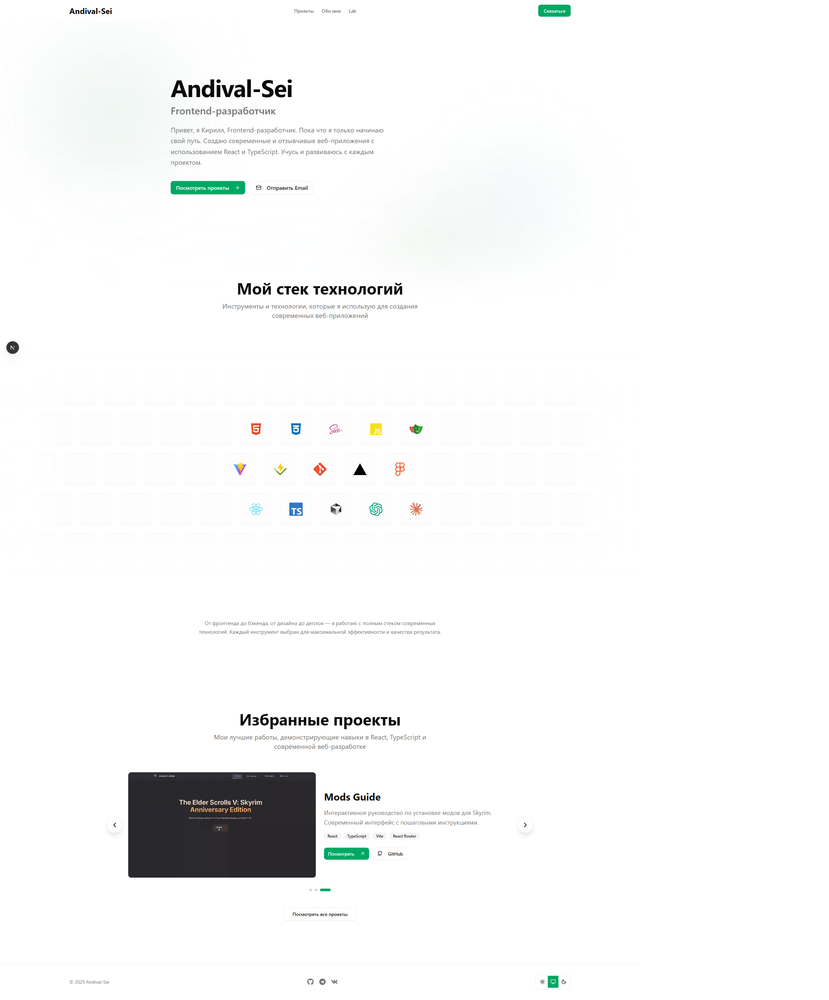
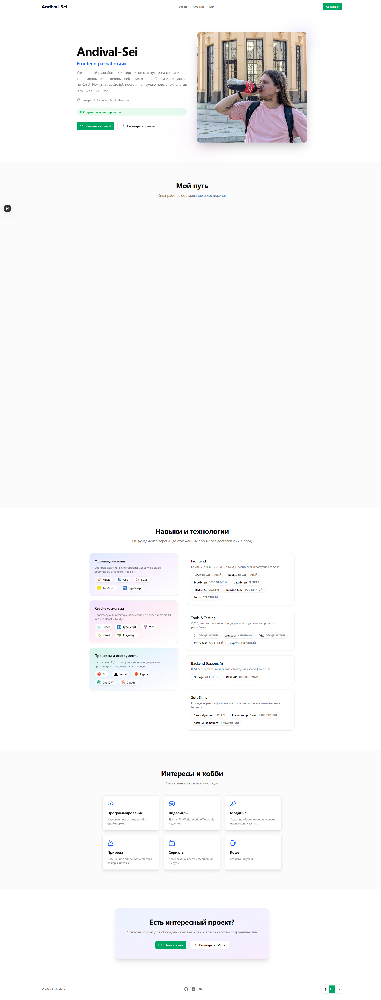
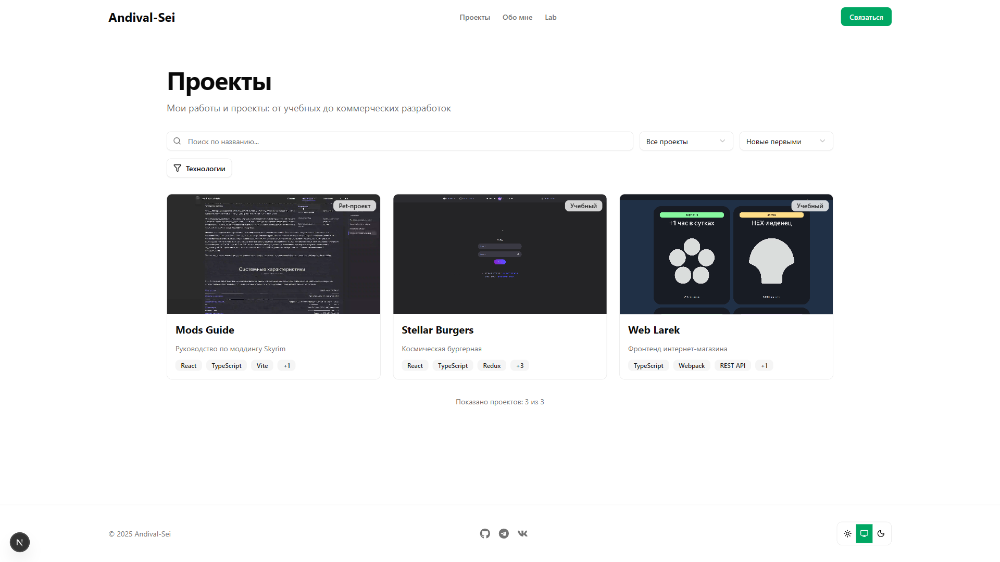
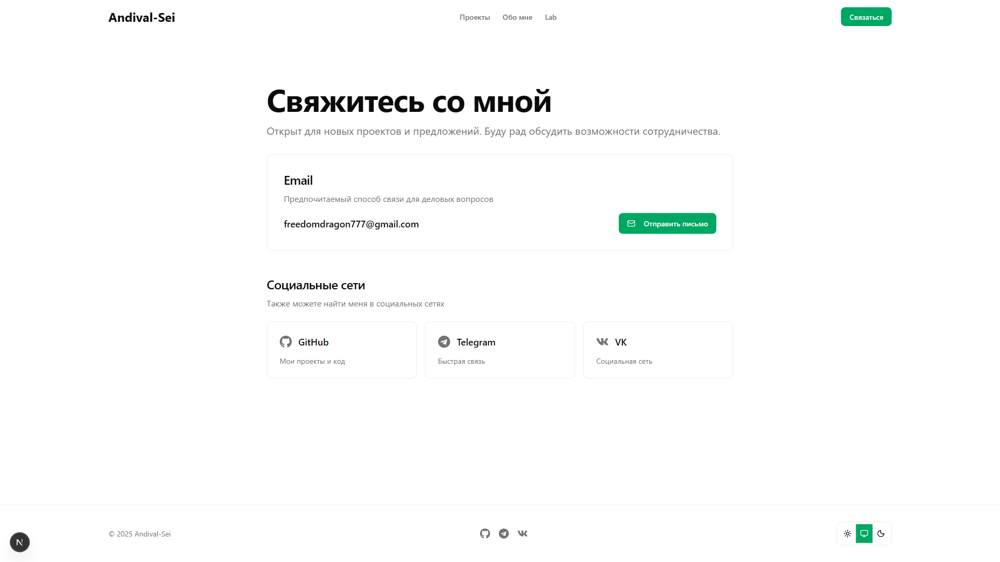
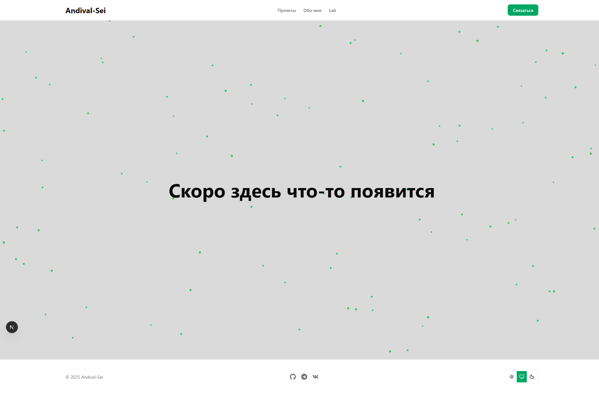

# 🚀 Andival-Sei Portfolio

Современное портфолио Frontend разработчика, построенное на Next.js 15 с фокусом на производительность, SEO и доступность.

[](https://github.com/Andival-Sei/andival-sei-dev/actions)
[](https://codecov.io/gh/Andival-Sei/andival-sei-dev)
[](LICENSE)
[](https://www.typescriptlang.org/)
[](https://nextjs.org/)
[](https://react.dev/)
[](https://tailwindcss.com/)
[](https://vitest.dev/)

## 📸 Скриншоты

<div align="center">
  
  <p><em>Главная страница</em></p>
</div>

<details>
<summary>Посмотреть больше скриншотов</summary>

<div align="center">
  
  <p><em>Страница обо мне</em></p>
  
  
  <p><em>Страница проектов</em></p>
  
  
  <p><em>Страница контактов</em></p>
  
  
  <p><em>Лаборатория экспериментов</em></p>
</div>

</details>

## 🛠️ Стек технологий

### Core

- **[Next.js 15](https://nextjs.org/)** - React framework с App Router и Turbopack
- **[React 19](https://react.dev/)** - Библиотека для создания пользовательских интерфейсов
- **[TypeScript](https://www.typescriptlang.org/)** - Типизированный JavaScript

### Styling

- **[Tailwind CSS v4](https://tailwindcss.com/)** - Utility-first CSS framework
- **[shadcn/ui](https://ui.shadcn.com/)** - Переиспользуемые компоненты на базе Radix UI
- **[next-themes](https://github.com/pacocoursey/next-themes)** - Поддержка темной темы

### Testing & Quality

- **[Vitest](https://vitest.dev/)** - Быстрый unit-test runner
- **[Testing Library](https://testing-library.com/)** - Тестирование React компонентов
- **[ESLint](https://eslint.org/)** + **[Prettier](https://prettier.io/)** - Линтинг и форматирование кода

### UI Components

- **[Radix UI](https://www.radix-ui.com/)** - Доступные компоненты без стилей
- **[Lucide React](https://lucide.dev/)** - Иконки
- **[React Icons](https://react-icons.github.io/react-icons/)** - Набор иконок

## ✨ Ключевые особенности

- ✅ **SEO оптимизация** - sitemap.xml, robots.txt, Open Graph, структурированные данные
- ✅ **Адаптивный дизайн** - от мобильных до ultra-wide мониторов (280px - 2560px+)
- ✅ **Темная/светлая тема** - с поддержкой системных настроек
- ✅ **Error Boundary** - обработка ошибок и graceful degradation
- ✅ **Высокое покрытие тестами** - 506 тестов, 60%+ code coverage
- ✅ **TypeScript Strict Mode** - полная типизация для надежности
- ✅ **Accessibility (A11y)** - WCAG AA compliance
- ✅ **Performance** - оптимизация с Turbopack, lazy loading, ISR
- ✅ **Верификация SEO** - Google Search Console и Yandex Webmaster

## 📁 Структура проекта

```
andival-sei-dev/
├── src/
│   ├── app/              # Next.js App Router pages
│   │   ├── page.tsx      # Главная страница
│   │   ├── about/        # О себе
│   │   ├── projects/     # Проекты
│   │   ├── contact/      # Контакты
│   │   └── lab/          # Лаборатория
│   ├── components/       # React компоненты
│   │   ├── ui/          # shadcn/ui компоненты
│   │   ├── sections/    # Секции страниц
│   │   └── __tests__/   # Тесты компонентов
│   ├── data/            # Статические данные (проекты, технологии)
│   ├── lib/             # Утилиты и хелперы
│   └── types/           # TypeScript типы
├── public/              # Статические файлы
│   ├── images/          # Изображения
│   ├── videos/          # Видео для проектов
│   └── screenshots/     # Скриншоты для README
└── docs/                # Документация проекта
```

## 🚀 Быстрый старт

### Предварительные требования

- Node.js 20+
- pnpm 8+

### Установка

```bash
# 1. Клонировать репозиторий
git clone https://github.com/Andival-Sei/andival-sei-dev.git
cd andival-sei-dev

# 2. Установить зависимости
pnpm install

# 3. Настроить переменные окружения
cp env-example.txt .env.local

# 4. Отредактировать .env.local (добавить свои данные)

# 5. Запустить dev сервер
pnpm dev
```

Откройте [http://localhost:3000](http://localhost:3000) в браузере.

## 📝 Доступные команды

### Разработка

```bash
pnpm dev              # Запуск dev сервера с Turbopack
pnpm build            # Production сборка
pnpm start            # Запуск production сервера
pnpm lint             # ESLint проверка
pnpm format           # Форматирование Prettier
pnpm format:check     # Проверка форматирования
```

### Тестирование

```bash
pnpm test             # Запуск тестов в watch mode
pnpm test:run         # Разовый запуск всех тестов
pnpm test:ui          # Vitest UI для визуального тестирования
pnpm test:coverage    # Отчет о покрытии кода
```

### Проверки качества

```bash
pnpm tsc --noEmit              # TypeScript проверка типов
pnpm lint                      # ESLint без автофикса
pnpm format:check              # Prettier проверка
```

## 🧪 Тестирование

Проект имеет комплексное покрытие тестами:

- **506 тестов** - все проходят успешно ✅
- **60%+ покрытие** - unit и integration тесты
- **Vitest** - быстрый test runner
- **Testing Library** - тестирование React компонентов
- **Snapshot тесты** - для отслеживания изменений UI

Запустить тесты:

```bash
# Watch mode для разработки
pnpm test

# CI/CD режим
pnpm test:run

# С отчетом о покрытии
pnpm test:coverage
```

## 🌍 Переменные окружения

Создайте `.env.local` на основе `env-example.txt`:

```env
# Конфигурация сайта
NEXT_PUBLIC_SITE_URL=https://your-domain.com
NEXT_PUBLIC_SITE_NAME=Your Portfolio Name

# Контакты
NEXT_PUBLIC_EMAIL=your@email.com
NEXT_PUBLIC_GITHUB=https://github.com/yourusername
NEXT_PUBLIC_TELEGRAM=https://t.me/yourusername
NEXT_PUBLIC_VK=https://vk.com/yourusername

# SEO верификация (опционально)
NEXT_PUBLIC_GOOGLE_VERIFICATION=google_code
NEXT_PUBLIC_YANDEX_VERIFICATION=yandex_code
```

## 🚢 Деплой

### Vercel (рекомендуется)

1. **Подключить GitHub репозиторий к Vercel**

   ```bash
   # Или используйте Vercel CLI
   npm i -g vercel
   vercel
   ```

2. **Настроить Environment Variables** в Vercel Dashboard:
   - Скопируйте все переменные из `.env.local`
   - Добавьте их в Project Settings → Environment Variables

3. **Deploy to Production**
   - Push в `main` ветку автоматически деплоит
   - Или используйте `vercel --prod`

### Другие платформы

Проект совместим с любой платформой, поддерживающей Next.js:

- Netlify
- Railway
- Render
- AWS Amplify

## 📚 Документация

- **[ROADMAP.md](docs/ROADMAP.md)** - планы развития и будущие фичи
- **[PROJECT_REVIEW.md](docs/PROJECT_REVIEW.md)** - комплексный анализ проекта
- **[SEO-VERIFICATION-GUIDE.md](docs/SEO-VERIFICATION-GUIDE.md)** - SEO настройки и верификация
- **[QUICK_ACTION_PLAN.md](docs/QUICK_ACTION_PLAN.md)** - план быстрых действий до production

## 🤝 Вклад в проект

Если вы нашли баг или хотите предложить улучшение:

1. Fork проекта
2. Создайте feature ветку (`git checkout -b feature/AmazingFeature`)
3. Закоммитьте изменения (`git commit -m 'feat: add amazing feature'`)
4. Push в ветку (`git push origin feature/AmazingFeature`)
5. Откройте Pull Request

## 📄 Лицензия

Этот проект распространяется под лицензией MIT. См. файл [LICENSE](LICENSE) для подробностей.

## 👤 Автор

**Andival-Sei (Кирилл)**

- 🌐 Website: [your-domain.com](https://your-domain.com)
- 💼 GitHub: [@Andival-Sei](https://github.com/Andival-Sei)
- 💬 Telegram: [@Andiewahl](https://t.me/Andiewahl)
- 📱 VK: [@andiewahl](https://vk.com/andiewahl)
- 📧 Email: freedomdragon777@gmail.com

## 🙏 Благодарности

- [Next.js](https://nextjs.org/) - за потрясающий React framework
- [Vercel](https://vercel.com/) - за бесплатный хостинг и инструменты
- [shadcn](https://ui.shadcn.com/) - за beautiful компоненты
- [Tailwind CSS](https://tailwindcss.com/) - за удобную стилизацию

---

<div align="center">
  <p>Сделано с ❤️ и ☕</p>
  <p>
    <a href="https://github.com/Andival-Sei/andival-sei-dev/stargazers">⭐ Star на GitHub</a>
  </p>
</div>
